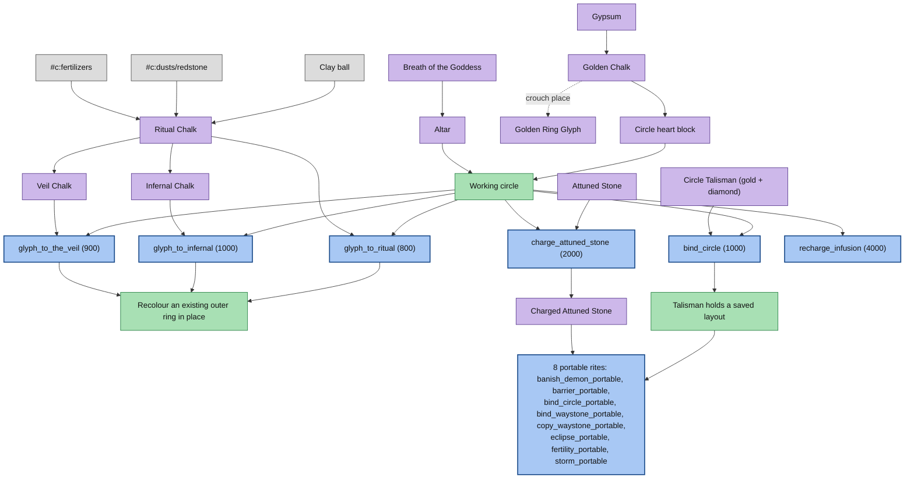

# Warlockery Ritual Progression Reference

This chart maps the 108 rituals shipped in `src/main/resources/data/warlockery/ritual/` to the items,
creatures and features that gate them. It is built from the ritual JSON, the runtime classes in
`src/main/java/com/kadamitas/warlockery/ritual/`, the crafting and machine data in
`src/main/resources/data/warlockery/recipe/` and `warlockery_machine/`, and the item tags in
`src/main/resources/data/warlockery/tags/item/`. Nothing here is inferred from play experience.

## How a ritual actually works

A Warlockery ritual is a place in the world, not a recipe in a GUI. Five things have to line up.

**The heart.** `RitualManager.isCircleCenter` requires the block at the centre to be `warlockery:circle`.
That block is placed by Golden Chalk (`ModItems.java:198`); crouching while placing puts down a
`circleglyphgolden` ring mark instead. Golden Chalk is therefore the single hard gate on the whole system,
and it comes from Gypsum plus red dye (`recipe/chalkheart_from_gypsum.json`), with Gypsum distilled from
Foul Fume, Quicklime and a Clay Jar (`warlockery_machine/distill_vitriol.json`).

**The rings.** Each ritual declares a map of glyph block ids to counts. `ChalkCircleLayout` does not use
those counts as literal mark counts. It sorts the declared glyphs by id, picks a distinct ring size for
each from `SMALL`, `MEDIUM`, `LARGE`, and the required number of marks comes from the ring geometry in
`ChalkCircleLayout.Size.createOffsets` with radii 3, 5 and 7 from `ChalkCircleRules`. The real mark counts
are **16 for the small ring, 28 for the medium ring and 40 for the large ring**. The declared JSON number
only steers `preferredSize`: 8 or fewer prefers small, 9 to 12 prefers medium, more prefers large. A ritual
may use at most three rings; a fourth throws at load. All ring sizes in the table below are computed with
that algorithm, not copied from the JSON.

Three chalk colours draw ring marks: Ritual Chalk (`circleglyphritual`), Infernal Chalk
(`circleglyphinfernal`) and Veil Chalk (`circleglyph_veil`). Infernal and Veil chalk are both upgrades of
Ritual Chalk (`recipe/chalkinfernal.json`, `recipe/chalk_veil.json`), so chalk is a genuine tier: every
infernal or veil rite implies you already have the ritual-chalk rite behind it.

**The altar.** `power` in the JSON is altar power consumed on activation. `RitualManager.findBestAltar`
picks the highest-power valid altar multiblock nearby, and `consumeAltarPower` spends the amount. A ritual
with `power: 0` needs no altar at all; those are the portable rites that instead keep a Circle Talisman on
the ground. Altar power ranges from 500 (`bind_waystone`) to 8000 (`rain_of_toads`).

**The offerings.** Ingredients are loose item entities within 6 blocks of the centre
(`RitualManager.nearbyItems`), not pedestal slots. Some are consumed, some are only read and left alone
(marked with `*` in the table): a Circle Talisman, a Sympathetic Vial carrying an imprint, a bound
Waystone. Three rituals also demand living sacrifices through `requirements.entities`: `bind_death`,
`blood_audience` and `hell_on_earth`.

**The conditions.** `RitualManager.matchesStructureAndWorld` checks night or day, full moon, rain, thunder,
dimension, and a minimum participant count. Recruited Circle Mages count toward that participant number
alongside players (`manual.warlockery.circles.chalk` in `en_us.json`). Ritual inhibitor blocks nearby veto
the rite, and nothing works inside the spirit world. On top of that, `actionEnvironmentRequirement` adds
per-action gates: four lava sources for `volcano`, four bloodied wicker bundles for
`summon_thorned_pursuer`, clear summoning space for every `summon_entity`, a recorded biome book for
`climate_change`, an owned familiar for `call_familiar`, `hex_wolf` and `corrupt_doll`, and a sleeping
bound target for `manifestation`.

Activation itself is a timed session. `casting_time` ticks pass with the requirements rechecked, then
`complete` runs the action. The floating display shows one line per requirement with a green check when
everything is satisfied.

## Legend

| Colour | Meaning |
| --- | --- |
| Grey | Vanilla Minecraft item or block |
| Purple | Warlockery item or block |
| Blue | Ritual |
| Red | Creature summoned or created by a ritual |
| Green | Unlocked feature or persistent world state |

## Overview

The standalone source for this diagram is `docs/ritual-progression.mmd`.

```mermaid
graph TD
    classDef vanilla fill:#dcdcdc,stroke:#4a4a4a,stroke-width:1px,color:#111
    classDef witem fill:#cdb8ea,stroke:#54338a,stroke-width:1px,color:#111
    classDef ritual fill:#a8c8f4,stroke:#1d4d8c,stroke-width:2px,color:#111
    classDef mob fill:#f3a8a8,stroke:#8c1d1d,stroke-width:1px,color:#111
    classDef feature fill:#a8e0b4,stroke:#1d7a3c,stroke-width:1px,color:#111

    subgraph S0["Stage 0 - Bench and machines, no circle yet"]
        vClay["Clay ball + redstone + fertilizer"]:::vanilla
        wChalkR["Ritual Chalk"]:::witem
        vBlaze["Blaze powder"]:::vanilla
        vEnder["Ender pearl"]:::vanilla
        wChalkI["Infernal Chalk"]:::witem
        wChalkV["Veil Chalk"]:::witem
        wGypsum["Gypsum (distillery)"]:::witem
        wChalkG["Golden Chalk"]:::witem
        wBreath["Breath of the Goddess (alchemical oven)"]:::witem
        wAltar["Altar multiblock"]:::witem
        wFocus["Arcane Focus"]:::witem
        wCircle["Circle heart block"]:::witem
    end

    vClay --> wChalkR
    wChalkR --> wChalkI
    vBlaze --> wChalkI
    wChalkR --> wChalkV
    vEnder --> wChalkV
    wGypsum --> wChalkG
    wChalkG --> wCircle
    wBreath --> wAltar

    fCircle["Working circle: heart + rings + powered altar"]:::feature
    wCircle --> fCircle
    wChalkR --> fCircle
    wAltar --> fCircle
    wFocus --> fCircle

    subgraph S1["Stage 1 - First rites on a plain ritual ring"]
        rGlyph["glyph_to_ritual / glyph_to_infernal / glyph_to_the_veil"]:::ritual
        rBindCircle["bind_circle"]:::ritual
        rBindWay["bind_waystone"]:::ritual
        rCharge["charge_attuned_stone"]:::ritual
        rCook["cook_food"]:::ritual
        rRaise["raise_earth_small / raise_earth / raise_earth_large"]:::ritual
        rSanctity["sanctity"]:::ritual
        rTranspose["transpose_ore"]:::ritual
    end

    fCircle --> rGlyph
    fCircle --> rBindCircle
    fCircle --> rBindWay
    fCircle --> rCharge
    fCircle --> rCook
    fCircle --> rRaise
    fCircle --> rSanctity
    fCircle --> rTranspose

    wTalisman["Circle Talisman"]:::witem
    wStoneC["Charged Attuned Stone"]:::witem
    wWayBound["Bound Waystone"]:::witem
    fPortable["Portable rites: zero altar power, talisman kept"]:::feature

    rBindCircle --> wTalisman
    rCharge --> wStoneC
    rBindWay --> wWayBound
    wTalisman --> fPortable
    wStoneC --> fPortable
    rGlyph --> fCircle

    subgraph S2["Stage 2 - Branch openers, one per chalk colour"]
        rSummonFam["summon_familiar / summon_cat_familiar"]:::ritual
        rSpectralStone["spectral_stone"]:::ritual
        rSummonImp["summon_imp"]:::ritual
        rInfusion["infusion_earth / _light / _ender / _sky / _hell"]:::ritual
        rStorm["storm / storm_large"]:::ritual
        rFertility["fertility / forestation / natures_power"]:::ritual
        rNecro["necrostone"]:::ritual
    end

    fCircle --> rSummonFam
    fCircle --> rSpectralStone
    fCircle --> rSummonImp
    fCircle --> rInfusion
    fCircle --> rStorm
    fCircle --> rFertility
    fCircle --> rNecro
    wChalkV --> rSpectralStone
    wChalkI --> rSummonImp

    mFamiliar["Spectral Familiar / Familiar Cat"]:::mob
    mImp["Imp"]:::mob
    wSpectralStone["Spectral Stone"]:::witem
    wNecroStone["Necromantic Stone"]:::witem
    fInfusion["Infusion paths on the Arcane Focus"]:::feature

    rSummonFam --> mFamiliar
    rSummonImp --> mImp
    rSpectralStone --> wSpectralStone
    rNecro --> wNecroStone
    rInfusion --> fInfusion

    subgraph S3["Stage 3 - Sympathetic magic and the hex line"]
        wVial["Sympathetic Vial"]:::witem
        fImprint["Bound imprint drives every hex, cure and transposition"]:::feature
        rHex["hex_misfortune / _sinking / _insanity / _overheating / _nightmare / _heat_metal"]:::ritual
        rCure["cure_misfortune / _sinking / _insanity / _overheating / _nightmare"]:::ritual
        rCorrupt["corrupt_doll"]:::ritual
        rTeleEnt["teleport_entity"]:::ritual
        rPrior["prior_incarnation"]:::ritual
    end

    fCircle --> wVial
    wVial --> fImprint
    fImprint --> rHex
    fImprint --> rCure
    fImprint --> rCorrupt
    fImprint --> rTeleEnt
    fImprint --> rPrior
    mFamiliar --> rCorrupt

    subgraph S4["Stage 4 - Spirits, demons and greater summoning"]
        rSummonSpirits["summon_spectre / summon_banshee / summon_poltergeist / summon_lost_soul"]:::ritual
        rBindSpectral["bind_spectral"]:::ritual
        rBindFetish["bind_fetish / bind_trent / bind_witch_ladder"]:::ritual
        rSummonDemon["summon_demon"]:::ritual
        rInfuseMirror["infuse_mirror"]:::ritual
        rManifest["manifestation"]:::ritual
        rEclipse["eclipse"]:::ritual
        rClimate["climate_change"]:::ritual
        rVolcano["volcano"]:::ritual
    end

    wSpectralStone --> rBindSpectral
    fCircle --> rSummonSpirits
    wChalkV --> rSummonSpirits
    rSummonSpirits --> mSpirits
    mSpirits["Spectre / Banshee / Poltergeist / Lost Soul"]:::mob
    mSpirits --> rBindSpectral
    mSpirits --> rBindFetish
    wChalkI --> rSummonDemon
    rSummonDemon --> mDemon
    mDemon["Demon"]:::mob
    mDemon --> wDemonheart
    wDemonheart["Demon Heart"]:::witem
    rInfuseMirror --> wMirror
    wMirror["Infernal Mirror"]:::witem
    fCircle --> rManifest
    fCircle --> rEclipse
    fCircle --> rClimate
    fCircle --> rVolcano

    subgraph S5["Stage 5 - Capstones"]
        rBindDeath["bind_death"]:::ritual
        rHellOnEarth["hell_on_earth"]:::ritual
        rThorned["summon_thorned_pursuer"]:::ritual
        rBloodAudience["blood_audience"]:::ritual
        rHexWolf["hex_wolf"]:::ritual
        rMarriage["marriage"]:::ritual
        rSummonWither["summon_wither"]:::ritual
        rReflection["summon_reflection"]:::ritual
    end

    mSpirits --> rBindDeath
    wDemonheart --> rHellOnEarth
    wWayBound --> rHellOnEarth
    wDemonheart --> rThorned
    wMirror --> rReflection
    wNecroStone --> rSummonWither
    wChalkG --> rMarriage
    fImprint --> rHexWolf
    mFamiliar --> rHexWolf
    fCircle --> rBloodAudience

    mDeath["Death"]:::mob
    mNaamah["Naamah"]:::mob
    mThorned["Thorned Pursuer"]:::mob
    mEcho["Echo Shade"]:::mob
    fHellRift["Hell rift: timed undead spawner, drains 200 power per second"]:::feature
    fVampire["Vampire initiation"]:::feature
    fWerewolf["Lycanthropy"]:::feature
    fMarriage["Marriage bond and shared buffs"]:::feature

    rBindDeath --> mDeath
    rHellOnEarth --> fHellRift
    rThorned --> mThorned
    rBloodAudience --> mNaamah
    mNaamah --> fVampire
    rHexWolf --> fWerewolf
    rMarriage --> fMarriage
    rReflection --> mEcho
```

Sources for the overview: `recipe/chalkritual.json`, `recipe/chalkinfernal.json`, `recipe/chalk_veil.json`,
`recipe/chalkheart_from_gypsum.json`, `recipe/altar.json`, `recipe/arcane_focus.json`,
`warlockery_machine/distill_vitriol.json`, `warlockery_machine/oven_fume_breath_of_the_goddess.json`,
`registry/ModItems.java:198`, `ritual/RitualManager.java` (`isCircleCenter`, `consumeAltarPower`,
`nearbyItems`, `matchesStructureAndWorld`), `ritual/ChalkCircleLayout.java`, `ritual/HellRiftRules.java`,
and the ritual JSON named in each node.

## Branch 1: chalk tiers and circle infrastructure

Sources: `ritual/glyph_to_ritual.json`, `glyph_to_infernal.json`, `glyph_to_the_veil.json`,
`bind_circle.json`, `bind_circle_portable.json`, `charge_attuned_stone.json`, `recharge_infusion.json`,
`barrier_portable.json`, `banish_demon_portable.json`, `bind_waystone_portable.json`,
`copy_waystone_portable.json`, `eclipse_portable.json`, `fertility_portable.json`, `storm_portable.json`,
`recipe/circletalisman.json`, `recipe/ingredient_attuned_stone.json`,
`ritual/RitualManager.java` (`TRANSFORM_CHALKS`, `inspectTransform`, `consumeTransformChalk`).

## Branch 2: binding, familiars and spirits

```mermaid
graph TD
    classDef vanilla fill:#dcdcdc,stroke:#4a4a4a,color:#111
    classDef witem fill:#cdb8ea,stroke:#54338a,color:#111
    classDef ritual fill:#a8c8f4,stroke:#1d4d8c,stroke-width:2px,color:#111
    classDef mob fill:#f3a8a8,stroke:#8c1d1d,color:#111
    classDef feature fill:#a8e0b4,stroke:#1d7a3c,color:#111

    will["Focused Will (distillery)"]:::witem --> sFam["summon_familiar (1800, night)"]:::ritual
    fish["#c:foods/raw_fish"]:::vanilla --> sFam
    will --> sCat["summon_cat_familiar (1500, night)"]:::ritual
    sFam --> famSpec["Spectral Familiar"]:::mob
    sCat --> famCat["Familiar Cat"]:::mob

    needle["Bone Needle"]:::witem --> bindFam["bind_familiar (1500)"]:::ritual
    will --> bindFam
    famSpec --> bindFam
    famCat --> bindFam
    bindFam --> owned["Owned familiar"]:::feature
    owned --> callFam["call_familiar (1200)"]:::ritual
    owned --> gateFam["Gate on hex_wolf and corrupt_doll"]:::feature

    coven["#warlockery:creature_interactions/coven_offerings"]:::witem --> sMage["summon_circle_mage (1800)"]:::ritual
    sMage --> mage["Circle Mage"]:::mob
    mage --> coven2["Recruited mages count as coven participants"]:::feature

    dust["Spectral Dust (spirit mob drops)"]:::witem --> sSpectre["summon_spectre (1900, night)"]:::ritual
    dust --> sPolt["summon_poltergeist (1900, night)"]:::ritual
    spirit["Subdued Spirit"]:::witem --> sBanshee["summon_banshee (2200, night)"]:::ritual
    cotton["#warlockery:disturbed_fibers"]:::witem --> sBanshee
    congealed["#warlockery:congealed_spirits"]:::witem --> sLost["summon_lost_soul (1700, night)"]:::ritual

    sSpectre --> spectre["Spectre"]:::mob
    sPolt --> polt["Poltergeist"]:::mob
    sBanshee --> banshee["Banshee"]:::mob
    sLost --> lost["Lost Soul"]:::mob

    stoneBase["Attuned Stone + spectral dust + congealed spirit + condensed fear"]:::witem --> sStone["spectral_stone (1600, night)"]:::ritual
    sStone --> specStone["Spectral Stone"]:::witem
    specStone --> bindSpec["bind_spectral (2000)"]:::ritual
    spectre --> bindSpec
    banshee --> bindSpec
    polt --> bindSpec
    bindSpec --> refilled["Refilled Spectral Stone"]:::feature

    spectre --> fetish["bind_fetish / bind_trent / bind_witch_ladder (2200)"]:::ritual
    banshee --> fetish
    polt --> fetish
    fetish --> guard["Scarecrow, Trent Effigy or Witch Ladder gains a protective mode"]:::feature

    banshee --> bindDeath["bind_death (6000, full moon night)<br/>sacrifices 5 + 5 + 5"]:::ritual
    polt --> bindDeath
    spectre --> bindDeath
    bindDeath --> death["Death"]:::mob

    spirit --> manifest["manifestation (2400, night)"]:::ritual
    manifest --> ghosts["Sleeping bound spirit walkers become mobile ghosts"]:::feature
```

Sources: `ritual/summon_familiar.json`, `summon_cat_familiar.json`, `bind_familiar.json`,
`call_familiar.json`, `summon_circle_mage.json`, `summon_spectre.json`, `summon_poltergeist.json`,
`summon_banshee.json`, `summon_lost_soul.json`, `spectral_stone.json`, `bind_spectral.json`,
`bind_fetish.json`, `bind_trent.json`, `bind_witch_ladder.json`, `bind_death.json`, `manifestation.json`,
`tags/item/creature_interactions/coven_offerings.json`, `tags/item/congealed_spirits.json`,
`tags/item/disturbed_fibers.json`, `tags/item/spectral_stone_bases.json`,
`loot_table/entities/spectre.json`, `banshee.json`, `spirit.json`,
`ritual/BindingRules.java`, `ritual/ManifestationRules.java`,
`ritual/RitualManager.java` (`BIND_ENTITY`, `BIND_FETISH`, `CALL_FAMILIAR` conditions).

## Branch 3: demons, infernal chalk and hell rifts

```mermaid
graph TD
    classDef vanilla fill:#dcdcdc,stroke:#4a4a4a,color:#111
    classDef witem fill:#cdb8ea,stroke:#54338a,color:#111
    classDef ritual fill:#a8c8f4,stroke:#1d4d8c,stroke-width:2px,color:#111
    classDef mob fill:#f3a8a8,stroke:#8c1d1d,color:#111
    classDef feature fill:#a8e0b4,stroke:#1d7a3c,color:#111

    chalkI["Infernal Chalk"]:::witem --> infernalRing["Infernal ring available"]:::feature
    blood["Infernal Blood (distillery)"]:::witem --> sImp["summon_imp (1900, night)"]:::ritual
    amethyst["#c:gems/amethyst"]:::vanilla --> sImp
    sImp --> imp["Imp"]:::mob

    evil["Refined Evil (distillery)"]:::witem --> sDemon["summon_demon (2800, night)"]:::ritual
    blood --> sDemon
    blazeRod["#c:rods/blaze"]:::vanilla --> sDemon
    infernalRing --> sDemon
    sDemon --> demon["Demon"]:::mob
    demon --> heart["Demon Heart"]:::witem
    heart --> animus["Infernal Animus (craft): command bound demons"]:::feature

    blood --> infHell["infusion_hell (2100)"]:::ritual
    animus2["Infernal Animus"]:::witem --> infHell
    infHell --> fireproof["Infernal infusion path"]:::feature

    purity["Odour of Purity"]:::witem --> banish["banish_demon (1200)"]:::ritual
    banish --> cleared["Hostile supernaturals banished"]:::feature
    evil --> prison["imprisonment (1000)"]:::ritual
    prison --> ward["Imprisonment ward, 16 power per second"]:::feature

    heart --> hell["hell_on_earth (5000, overworld night)<br/>sacrifices 1 villager"]:::ritual
    soup["Redstone Soup (kettle)"]:::witem --> hell
    way["Waystone"]:::witem --> hell
    star["Nether star"]:::vanilla --> hell
    hell --> rift["Hell rift: undead spawn every 60 ticks,<br/>drains 200 altar power per second"]:::feature

    evil --> corrupt["corrupt_doll (7000)"]:::ritual
    doll["Doll"]:::witem --> corrupt
    vial["Sympathetic Vial"]:::witem --> corrupt
    corrupt --> stripped["Target's protective enchantments broken"]:::feature

    mirrorBlock["Mirror Block (craft)"]:::witem --> infMirror["infuse_mirror (3200, night)"]:::ritual
    blood --> infMirror
    infMirror --> mirror["Infernal Mirror"]:::witem
    mirror --> sRef["summon_reflection (3000, night)"]:::ritual
    evil --> sRef
    sRef --> echo["Echo Shade"]:::mob

    heart2["Demon Heart"]:::witem --> thorn["summon_thorned_pursuer (4800, full moon night)<br/>needs 4 bloodied wicker bundles"]:::ritual
    stone["Attuned Stone"]:::witem --> thorn
    thorn --> pursuer["Thorned Pursuer"]:::mob

    necro["Necromantic Stone"]:::witem --> blood2["blood_audience (5000, full moon night)<br/>Nami must be present, not consumed"]:::ritual
    luck["#warlockery:luck_essences"]:::witem --> blood2
    blood2 --> naamah["Naamah"]:::mob
    naamah --> vamp["Matriarch's Blood offering starts vampire initiation"]:::feature
    vamp --> cureV["cure_vampire (3600)"]:::ritual
```

Sources: `ritual/summon_imp.json`, `summon_demon.json`, `infusion_hell.json`, `banish_demon.json`,
`imprisonment.json`, `hell_on_earth.json`, `corrupt_doll.json`, `infuse_mirror.json`,
`summon_reflection.json`, `summon_thorned_pursuer.json`, `blood_audience.json`, `cure_vampire.json`,
`warlockery_machine/distill_infernal_blood.json`, `distill_refined_evil.json`,
`kettle_redstone_soup.json`, `recipe/ingredient_infernal_animus.json`, `recipe/mirror_block.json`,
`loot_table/entities/demon.json`, `tags/item/luck_essences.json`,
`ritual/HellRiftRules.java`, `ritual/HuntsmanSummoningStructure.java`, `ritual/RitualWardRules.java`.

## Branch 4: weather, biome and terrain

```mermaid
graph TD
    classDef vanilla fill:#dcdcdc,stroke:#4a4a4a,color:#111
    classDef witem fill:#cdb8ea,stroke:#54338a,color:#111
    classDef ritual fill:#a8c8f4,stroke:#1d4d8c,stroke-width:2px,color:#111
    classDef feature fill:#a8e0b4,stroke:#1d7a3c,color:#111

    breath["Breath of the Goddess"]:::witem --> storm["storm (1400)"]:::ritual
    rod["Lightning rod"]:::vanilla --> storm
    breath --> stormL["storm_large (2600)"]:::ritual
    breath --> stormP["storm_portable (0, talisman)"]:::ritual
    storm --> thunder["Thunderstorm; also gates summon_storm_simian"]:::feature
    stormL --> thunder
    stormP --> thunder
    thunder --> hexGate["Every hex_* rite except heat_metal needs thunder"]:::feature

    ghost["#warlockery:ghost_light_reagents"]:::witem --> eclipse["eclipse (3200, day only)"]:::ritual
    clock["Clock"]:::vanilla --> eclipse
    eclipse --> night["Clock held at night, darkness applied, then restored"]:::feature
    ghost --> eclipseP["eclipse_portable (0, day only)"]:::ritual

    glow["#c:dusts/glowstone x4"]:::vanilla --> climate["climate_change (2600)<br/>needs a recorded biome book"]:::ritual
    climate --> shift["Biome shift, 1 to 4 chunk radius<br/>up to 3 nether stars, 5 participants + seer stone empower it"]:::feature

    lava["4 nearby lava sources"]:::vanilla --> volcano["volcano (3000)"]:::ritual
    magma["Magma block"]:::vanilla --> volcano
    reek["Reek of Misfortune"]:::witem --> volcano
    volcano --> column["Volcanic column"]:::feature

    sprout["Brew of Sprouting (kettle)"]:::witem --> raise["raise_earth_small / raise_earth / raise_earth_large"]:::ritual
    erosion["Brew of Erosion (custom cauldron brew)"]:::witem --> part["part_earth (0 power)"]:::ritual
    frozen["Frozen Heart"]:::witem --> ice["ice_shell (2200, 3 participants)"]:::ritual
    ender["Ender Dew"]:::witem --> transpose["transpose_ore (1400)"]:::ritual

    breath2["Breath of the Goddess"]:::witem --> fert["fertility / fertility_portable"]:::ritual
    seed["Bramble Colossus Seed"]:::witem --> forest["forestation (2600)"]:::ritual
    soul["#warlockery:world_souls"]:::witem --> nature["natures_power (2400)"]:::ritual
    soul --> infEarth["infusion_earth (1800)"]:::ritual
    reek2["Reek of Misfortune"]:::witem --> blight["blight (900)"]:::ritual
    hunger["Mellifluous Hunger"]:::witem --> drain["drain_growth (900)"]:::ritual
    coal["#minecraft:coals"]:::vanilla --> cook["cook_food (600)"]:::ritual
```

Sources: `ritual/storm.json`, `storm_large.json`, `storm_portable.json`, `eclipse.json`,
`eclipse_portable.json`, `climate_change.json`, `volcano.json`, `raise_earth.json`,
`raise_earth_small.json`, `raise_earth_large.json`, `part_earth.json`, `ice_shell.json`,
`transpose_ore.json`, `fertility.json`, `fertility_portable.json`, `forestation.json`,
`natures_power.json`, `infusion_earth.json`, `blight.json`, `drain_growth.json`, `cook_food.json`,
`ritual/BiomeShiftPlan.java`, `ritual/RitualTerrainPlan.java`, `ritual/RitualEclipseData.java`,
`ritual/RitualManager.java` (`REQUIRED_VOLCANIC_SOURCES`, `CLIMATE_EMPOWERMENT_PARTICIPANTS`,
`climateShiftPlan`), `warlockery_machine/kettle_ingredient_brew_sprouting.json`,
`custom_brew_component/effect/erosion.json`.

## Branch 5: hexes, cures and transformations

```mermaid
graph TD
    classDef vanilla fill:#dcdcdc,stroke:#4a4a4a,color:#111
    classDef witem fill:#cdb8ea,stroke:#54338a,color:#111
    classDef ritual fill:#a8c8f4,stroke:#1d4d8c,stroke-width:2px,color:#111
    classDef mob fill:#f3a8a8,stroke:#8c1d1d,color:#111
    classDef feature fill:#a8e0b4,stroke:#1d7a3c,color:#111

    bottle["Glass bottle + bone + string"]:::vanilla --> vial["Sympathetic Vial"]:::witem
    vial --> imprint["Bound imprint on a creature or player"]:::feature
    thunderReq["Thunderstorm"]:::feature --> hexes

    imprint --> hexes["hex_misfortune (1600) / hex_sinking (1900)<br/>hex_insanity (1900) / hex_overheating (2200)<br/>hex_nightmare (2600)"]:::ritual
    reek["Reek of Misfortune"]:::witem --> hexes
    fear["Condensed Fear"]:::witem --> hexes
    grave["Graveyard Dust"]:::witem --> hexes
    foul["Foul Fume"]:::witem --> hexes
    cotton["#warlockery:disturbed_fibers"]:::witem --> hexes

    hexes --> persistent["Persistent hex state on the target"]:::feature
    imprint --> cures["cure_misfortune / cure_sinking / cure_insanity<br/>cure_overheating / cure_nightmare"]:::ritual
    purity["Odour of Purity"]:::witem --> cures
    dream["Charm of Disrupted Dreams"]:::witem --> cures
    frozen["Frozen Heart"]:::witem --> cures
    breath["Breath of the Goddess"]:::witem --> cures
    cures --> cleared["Hex cleared"]:::feature

    imprint --> heat["hex_heat_metal (2800)"]:::ritual
    silver["Silver Dust"]:::witem --> heat
    heat --> heatOut["See gaps: falls through to Bad Omen today"]:::feature

    imprint --> blind["blindness (1000)"]:::ritual
    blind --> blindOut["Vanilla Blindness, no paired cure"]:::feature

    imprint --> wolf["hex_wolf (4200, full moon night, 7 participants)"]:::ritual
    token["Wolf Token"]:::witem --> wolf
    bane["Wolfsbane"]:::witem --> wolf
    familiar["Owned familiar"]:::feature --> wolf
    wolf --> lycan["Lycanthropy"]:::feature
    lycan --> cureW["cure_wolf (3400)"]:::ritual
    milk["Purified Milk"]:::witem --> cureW

    garlic["Garlic"]:::witem --> cureV["cure_vampire (3600)"]:::ritual
    milk --> cureV

    necroStone["Necromantic Stone"]:::witem --> fortify["fortification_of_the_corpse (1500, night)"]:::ritual
    grave2["Graveyard Dust"]:::witem --> anguish["anguish_of_the_dead (1400, night)"]:::ritual
    grave2 --> mist["graveyard_mist (1700, night)"]:::ritual
    dust2["Spectral Dust"]:::witem --> veil["deathly_veil (1100, night)"]:::ritual
    toe["Toe of Frog"]:::witem --> toads["rain_of_toads (8000, 2 participants)"]:::ritual
    seer["Seer Stone"]:::witem --> toads
    toads --> frogs["Frogs"]:::mob
```

Sources: `ritual/hex_misfortune.json`, `hex_sinking.json`, `hex_insanity.json`, `hex_overheating.json`,
`hex_nightmare.json`, `hex_heat_metal.json`, `blindness.json`, `corrupt_doll.json`, `hex_wolf.json`,
`cure_misfortune.json`, `cure_sinking.json`, `cure_insanity.json`, `cure_overheating.json`,
`cure_nightmare.json`, `cure_wolf.json`, `cure_vampire.json`, `anguish_of_the_dead.json`,
`graveyard_mist.json`, `fortification_of_the_corpse.json`, `deathly_veil.json`, `rain_of_toads.json`,
`recipe/sympathetic_vial.json`, `tags/item/sympathetic_containers.json`,
`tags/item/lycanthropy_catalysts.json`, `tags/item/wolfsbane_reagents.json`,
`ritual/HexbreakingRules.java`, `ritual/HexBehaviors.java`, `ritual/hex/HexKind.java`,
`ritual/hex/HeatMetalRules.java`, `ritual/RitualManager.java` (`applyHex`, `targetLiving`, `cleanse`).

## Branch 6: utility, travel, infusion and bonds

```mermaid
graph TD
    classDef vanilla fill:#dcdcdc,stroke:#4a4a4a,color:#111
    classDef witem fill:#cdb8ea,stroke:#54338a,color:#111
    classDef ritual fill:#a8c8f4,stroke:#1d4d8c,stroke-width:2px,color:#111
    classDef mob fill:#f3a8a8,stroke:#8c1d1d,color:#111
    classDef feature fill:#a8e0b4,stroke:#1d7a3c,color:#111

    bone["#c:bones + flint"]:::vanilla --> needle["Bone Needle"]:::witem
    needle --> way["Waystone"]:::witem
    way --> bindWay["bind_waystone (500)"]:::ritual
    dew["Ender Dew"]:::witem --> bindWay
    bindWay --> bound["Bound Waystone"]:::witem
    bound --> tele["teleport_waystone (1000)"]:::ritual
    bound --> copy["copy_waystone (750)"]:::ritual
    bound --> simian["summon_storm_simian (2600, thunder)"]:::ritual
    simian --> mSimian["Storm Simian"]:::mob

    vial["Sympathetic Vial"]:::witem --> bindWayP["bind_waystone_player (1600)"]:::ritual
    warm["Warm Blood"]:::witem --> bindWayP
    bindWayP --> blooded["Blooded Waystone"]:::witem
    vial --> teleEnt["teleport_entity (1800)"]:::ritual
    vial --> statue["bind_statue_player (1800)"]:::ritual
    statue --> blessing["Hobgoblin Patron statue blesses the bound player"]:::feature
    vial --> prior["prior_incarnation (2800)"]:::ritual

    soul["#warlockery:world_souls"]:::witem --> iEarth["infusion_earth"]:::ritual
    veilSpirit["#warlockery:veil_spirits"]:::witem --> iEnder["infusion_ender"]:::ritual
    ghost["#warlockery:ghost_light_reagents"]:::witem --> iLight["infusion_light"]:::ritual
    owlet["Owlet's Wing"]:::witem --> iSky["infusion_sky (night)"]:::ritual
    blood["Infernal Blood"]:::witem --> iHell["infusion_hell"]:::ritual
    iEarth --> paths["Infusion paths, 7200 tick duration"]:::feature
    iEnder --> paths
    iLight --> paths
    iSky --> paths
    iHell --> paths
    paths --> recharge["recharge_infusion (4000)"]:::ritual

    broom["Broom"]:::witem --> iBroom["infuse_broom (1800)"]:::ritual
    ointment["#warlockery:flying_ointments"]:::witem --> iBroom
    iBroom --> eBroom["Enchanted Broom"]:::witem
    membrane["Phantom membrane"]:::vanilla --> iSoar["infuse_brew_soaring (1800)"]:::ritual
    congealed["#warlockery:congealed_spirits"]:::witem --> iGrave["infuse_brew_grave (1800, night)"]:::ritual

    quartz["Quartz Sphere"]:::witem --> iBall["infuse_crystal_ball (2000, night)"]:::ritual
    rebirth["Hint of Rebirth"]:::witem --> iBall
    iBall --> ball["Crystal Ball"]:::witem
    quartz --> iSeer["infuse_seer_stone (2300, night)"]:::ritual
    stoneC["Charged Attuned Stone"]:::witem --> iSeer
    iSeer --> seer["Seer Stone"]:::witem
    seer --> covenTools["Coven comms, climate empowerment, rain_of_toads"]:::feature
    splinter["Heartwood Splinter"]:::witem --> iBranch["infuse_mystic_branch (2200, night)"]:::ritual

    will["Focused Will"]:::witem --> barrier["barrier (1300) / barrier_large (2400)"]:::ritual
    purity["Odour of Purity"]:::witem --> sanctity["sanctity (800)"]:::ritual
    barrier --> wards["Persistent wards"]:::feature
    sanctity --> wards

    gold["Golden Chalk ring marks"]:::witem --> marriage["marriage (4200)"]:::ritual
    rings["2 Wedding Rings + Golden Thread"]:::witem --> marriage
    marriage --> bond["Marriage bond, shared proximity buffs"]:::feature
    bond --> divorce["divorce (1800)"]:::ritual

    food["Milk, hay, apple, beef, fish, mushroom"]:::vanilla --> beasts["call_beasts (6000, 4 participants)"]:::ritual
    goblinite["#c:ingots/goblinite"]:::witem --> patrons["summon_stonebroker (3200) / summon_forgewarden (3600)"]:::ritual
    hearts["#warlockery:creature_interactions/heart_offerings"]:::witem --> patrons
    patrons --> goblinPatrons["Goblin patrons"]:::mob
    mandrake["Mandrake Root"]:::witem --> sWitch["summon_witch (1300)"]:::ritual
    skulls["3 wither skulls + soul sand"]:::vanilla --> sWither["summon_wither (6000)"]:::ritual
    necroStone["Necromantic Stone"]:::witem --> sWither
    potion["Fermented spider eye + potion"]:::vanilla --> louse["summon_parasytic_louse (1400)"]:::ritual
```

Sources: `ritual/bind_waystone.json`, `bind_waystone_player.json`, `teleport_waystone.json`,
`copy_waystone.json`, `teleport_entity.json`, `bind_statue_player.json`, `prior_incarnation.json`,
`summon_storm_simian.json`, `infusion_*.json`, `recharge_infusion.json`, `infuse_broom.json`,
`infuse_brew_soaring.json`, `infuse_brew_grave.json`, `infuse_crystal_ball.json`,
`infuse_seer_stone.json`, `infuse_mystic_branch.json`, `barrier.json`, `barrier_large.json`,
`sanctity.json`, `marriage.json`, `divorce.json`, `call_beasts.json`, `summon_stonebroker.json`,
`summon_forgewarden.json`, `summon_witch.json`, `summon_wither.json`, `summon_parasytic_louse.json`,
`recipe/ingredient_bone_needle.json`, `recipe/ingredient_waystone.json`, `recipe/wedding_ring.json`,
`recipe/statue_of_hobgoblin_patron.json`, `tags/item/creature_interactions/heart_offerings.json`,
`ritual/PriorIncarnationData.java`, `ritual/marriage/MarriageData.java`,
`ritual/marriage/MarriageRuntime.java`, `ritual/RitualWardType.java`.

## All 108 rituals

Chalk rings are the values `ChalkCircleLayout` computes, with the real mark count in brackets.
Inputs use `w:` for `warlockery:`, `mc:` for `minecraft:`, `#` for a tag, and `*` for an item that is
checked but not consumed. Altar power of `none` means the ritual declares `power: 0`.

| Ritual id | Name | Chalk rings (marks) | Altar power | Inputs | Conditions | Outcome |
| --- | --- | --- | --- | --- | --- | --- |
| `anguish_of_the_dead` | Anguish of the Dead | veil small(16) + ritual medium(28) | 1400 | w:ingredient_graveyard_dust x2; #c:dusts/glowstone | night | anguish undead |
| `banish_demon` | Rite of Banishing | veil small(16) + ritual medium(28) | 1200 | w:ingredient_odour_of_purity; #c:ingots/gold | - | banish |
| `banish_demon_portable` | Portable Rite of Banishing | veil small(16) + ritual medium(28) | none (talisman/free) | w:circletalisman*; w:ingredient_odour_of_purity | - | banish |
| `barrier` | Rite of Protection | veil small(16) + ritual medium(28) | 1300 | w:ingredient_focused_will; #c:obsidians/normal x2 | - | protection ward |
| `barrier_large` | Rite of Greater Protection | veil medium(28) + ritual large(40) | 2400 | w:ingredient_focused_will x2; #c:obsidians/normal x4 | - | protection ward |
| `barrier_portable` | Portable Rite of Protection | veil small(16) + ritual medium(28) | none (talisman/free) | w:circletalisman*; w:ingredient_attuned_stone_charged | - | protection ward |
| `bind_circle` | Rite of Binding: Circle Talisman | ritual small(16) | 1000 | w:circletalisman*; #c:dusts/redstone | - | stores circle in w:circletalisman |
| `bind_circle_portable` | Portable Rite of Binding: Circle | ritual small(16) | none (talisman/free) | w:circletalisman*; w:ingredient_attuned_stone_charged; #c:dusts/glowstone | - | stores circle in w:circletalisman |
| `bind_death` | Rite of Binding: Death | veil small(16) + infernal medium(28) + ritual large(40) | 6000 | w:ingredient_bone_needle; w:ingredient_focused_will x2   sacrifice: #w:death_binding/banshees x5; #w:death_binding/poltergeists x5; #w:death_binding/spectres x5 | night, full moon | summons w:death |
| `bind_familiar` | Rite of Binding: Familiar | veil small(16) + ritual medium(28) | 1500 | w:ingredient_bone_needle; w:ingredient_focused_will | - | binds familiar |
| `bind_fetish` | Rite of Binding: Fetish | infernal small(16) + ritual medium(28) | 2200 | w:scarecrow; w:ingredient_spectral_dust x3 | - | binds w:scarecrow |
| `bind_spectral` | Rite of Binding: Spectral Creatures | veil small(16) + ritual medium(28) | 2000 | w:spectralstone*; w:ingredient_spectral_dust x3 | - | binds spectral |
| `bind_statue_player` | Rite of Binding: Statue | veil small(16) + ritual medium(28) | 1800 | w:sympathetic_vial*; w:statueofworship | - | binds w:statueofworship |
| `bind_trent` | Rite of Binding: Trent Effigy | infernal small(16) + ritual medium(28) | 2200 | w:trent; w:ingredient_spectral_dust x3 | - | binds w:trent |
| `bind_waystone` | Rite of Binding: Waystone | ritual small(16) | 500 | w:ingredient_waystone*; w:ingredient_ender_dew; #c:dusts/glowstone | - | binds a waystone to this spot |
| `bind_waystone_player` | Rite of Binding: Blooded Waystone | infernal small(16) + ritual medium(28) | 1600 | w:sympathetic_vial*; w:ingredient_waystone; w:ingredient_warm_blood | - | binds w:ingredient_waystone_creature_bound |
| `bind_waystone_portable` | Portable Rite of Binding: Waystone | ritual small(16) | none (talisman/free) | w:circletalisman*; w:ingredient_waystone*; w:ingredient_ender_dew | - | binds a waystone to this spot |
| `bind_witch_ladder` | Rite of Binding: Witch's Ladder | infernal small(16) + ritual medium(28) | 2200 | w:hex_ladder; w:ingredient_spectral_dust x3 | - | binds w:hex_ladder |
| `blight` | Hex of Blight | infernal small(16) + ritual medium(28) | 900 | w:ingredient_reek_of_misfortune; mc:poisonous_potato x2 | - | blight |
| `blindness` | Hex of Blindness | infernal small(16) + ritual medium(28) | 1000 | w:ingredient_condensed_fear; #c:dyes/black x2 | - | applies the blindness hex |
| `blood_audience` | Blood Audience | veil small(16) + ritual medium(28) + infernal large(40) | 5000 | w:ingredient_necro_stone; #w:luck_essences; mc:wither_rose; mc:ghast_tear   sacrifice: w:nami x1* | night, full moon | transform nami |
| `call_beasts` | Rite of Beastial Call | ritual large(40) | 6000 | mc:milk_bucket; mc:hay_block; mc:apple; mc:beef; #mc:fishes; mc:red_mushroom | 4 participants | call beasts |
| `call_familiar` | Rite of Calling: Familiar | veil small(16) + ritual medium(28) | 1200 | w:ingredient_focused_will | - | call familiar |
| `charge_attuned_stone` | Rite of Charging | ritual medium(28) | 2000 | w:ingredient_attuned_stone; w:ingredient_ash_wood; w:ingredient_quicklime; #c:dusts/glowstone; #c:dusts/redstone | - | produces w:ingredient_attuned_stone_charged |
| `climate_change` | Rite of Shifting Seasons | ritual large(40) | 2600 | #c:dusts/glowstone x4 | - | climate shift |
| `cook_food` | Rite of Broiling | ritual medium(28) | 600 | #mc:coals | - | cook |
| `copy_waystone` | Rite of Binding: Copy Waystone | ritual medium(28) | 750 | w:ingredient_waystone_bound*; w:ingredient_waystone*; #c:dusts/redstone x2 | - | copies a bound waystone |
| `copy_waystone_portable` | Portable Rite of Binding: Copy Waystone | ritual small(16) | none (talisman/free) | w:circletalisman*; w:ingredient_waystone_bound*; w:ingredient_waystone* | - | copies a bound waystone |
| `corrupt_doll` | Hex of the Corrupted Doll | infernal medium(28) + ritual large(40) | 7000 | w:sympathetic_vial*; w:doll; w:ingredient_refined_evil | - | applies the corrupt_doll hex |
| `cure_insanity` | Rite of Hexbreaking: Insanity | veil small(16) + ritual medium(28) | 2100 | w:sympathetic_vial*; w:ingredient_odour_of_purity | - | clears the insanity hex |
| `cure_misfortune` | Rite of Hexbreaking: Misfortune | veil small(16) + ritual medium(28) | 1900 | w:sympathetic_vial*; w:ingredient_odour_of_purity | - | clears the misfortune hex |
| `cure_nightmare` | Rite of Hexbreaking: Nightmare | veil medium(28) + ritual large(40) | 2800 | w:sympathetic_vial*; w:ingredient_charm_disrupted_dreams | - | clears the nightmare hex |
| `cure_overheating` | Rite of Hexbreaking: Overheating | veil medium(28) + ritual large(40) | 2400 | w:sympathetic_vial*; w:ingredient_frozen_heart | - | clears the overheating hex |
| `cure_sinking` | Rite of Hexbreaking: Sinking | veil small(16) + ritual medium(28) | 2100 | w:sympathetic_vial*; w:ingredient_breath_of_the_goddess | - | clears the sinking hex |
| `cure_vampire` | Rite of Hexbreaking: Vampirism | veil medium(28) + ritual large(40) | 3600 | w:sympathetic_vial*; w:garlic x4; w:ingredient_purified_milk | - | remove vampirism |
| `cure_wolf` | Rite of Hexbreaking: Lycanthropy | veil medium(28) + ritual large(40) | 3400 | w:sympathetic_vial*; w:ingredient_wolfsbane x4; w:ingredient_purified_milk | - | remove werewolf |
| `deathly_veil` | Deathly Veil | veil small(16) + ritual medium(28) | 1100 | w:ingredient_spectral_dust; #c:dyes/black | night | applies mc:invisibility |
| `divorce` | Rite of Severance | infernal small(16) + golden medium(28) | 1800 | w:wedding_ring*; mc:shears*; w:ingredient_foul_fume | - | divorce |
| `drain_growth` | Drain Growth | infernal small(16) + ritual medium(28) | 900 | w:ingredient_mellifluous_hunger; #c:crops/wheat x2 | - | drain growth |
| `eclipse` | Rite of Total Eclipse | infernal medium(28) + ritual large(40) | 3200 | #w:ghost_light_reagents; mc:clock | day | eclipse |
| `eclipse_portable` | Portable Rite of Total Eclipse | infernal small(16) + ritual medium(28) | none (talisman/free) | w:circletalisman*; #w:ghost_light_reagents; mc:clock | day | eclipse |
| `fertility` | Rite of Fertility | veil small(16) + ritual medium(28) | 2000 | w:ingredient_breath_of_the_goddess; #c:fertilizers x8 | - | fertility |
| `fertility_portable` | Portable Rite of Fertility | veil small(16) + ritual medium(28) | none (talisman/free) | w:circletalisman*; w:ingredient_breath_of_the_goddess; #c:fertilizers x8 | - | fertility |
| `forestation` | Rite of the Forest | veil medium(28) + ritual large(40) | 2600 | w:ingredient_bramble_colossus_seed; #mc:saplings x4; #c:fertilizers x8 | - | forestation |
| `fortification_of_the_corpse` | Fortification of the Corpse | infernal small(16) + ritual medium(28) | 1500 | w:ingredient_necro_stone*; #c:bones x4 | night | fortify undead |
| `glyph_to_infernal` | Rite of Glyphic Transformation: Infernal | ritual small(16) | 1000 | w:chalkinfernal | - | rewrites outer ring to w:circleglyphinfernal |
| `glyph_to_ritual` | Rite of Glyphic Transformation: Ritual | ritual small(16) | 800 | w:chalkritual | - | rewrites outer ring to w:circleglyphritual |
| `glyph_to_the_veil` | Rite of Glyphic Transformation: the Veil | ritual small(16) | 900 | w:chalk_veil | - | rewrites outer ring to w:circleglyph_veil |
| `graveyard_mist` | Graveyard Mist | veil small(16) + ritual medium(28) | 1700 | w:ingredient_graveyard_dust x3; w:ingredient_subdued_spirit | night | graveyard mist |
| `hell_on_earth` | Hex of Hell on Earth | ritual small(16) + infernal medium(28) + veil large(40) | 5000 | w:ingredient_redstone_soup; w:demonheart; w:ingredient_waystone; mc:nether_star   sacrifice: mc:villager x1 | night, overworld | hell on earth |
| `hex_heat_metal` | Heat Metal Hex | infernal medium(28) + ritual large(40) | 2800 | w:sympathetic_vial*; w:ingredient_silverdust; mc:blaze_powder x3 | - | applies the heat_metal hex |
| `hex_insanity` | Hex of Insanity | infernal small(16) + ritual medium(28) | 1900 | w:sympathetic_vial*; w:ingredient_condensed_fear | thunder | applies the insanity hex |
| `hex_misfortune` | Hex of Misfortune | infernal small(16) + ritual medium(28) | 1600 | w:sympathetic_vial*; w:ingredient_reek_of_misfortune | thunder | applies the misfortune hex |
| `hex_nightmare` | Hex of Waking Nightmare | infernal medium(28) + ritual large(40) | 2600 | w:sympathetic_vial*; #w:disturbed_fibers; w:ingredient_condensed_fear | thunder | applies the nightmare hex |
| `hex_overheating` | Hex of Overheating | infernal medium(28) + ritual large(40) | 2200 | w:sympathetic_vial*; w:ingredient_foul_fume; mc:blaze_powder x2 | thunder | applies the overheating hex |
| `hex_sinking` | Hex of Sinking | infernal small(16) + ritual medium(28) | 1900 | w:sympathetic_vial*; w:ingredient_graveyard_dust x2 | thunder | applies the sinking hex |
| `hex_wolf` | Hex of the Wolf | infernal medium(28) + ritual large(40) | 4200 | #w:sympathetic_containers*; #w:lycanthropy_catalysts; #w:wolfsbane_reagents x2 | night, full moon, 7 participants | transform werewolf |
| `ice_shell` | Rite of Icy Expansion | veil medium(28) + ritual large(40) | 2200 | w:ingredient_frozen_heart; mc:packed_ice x8 | 3 participants | ice sphere |
| `imprisonment` | Rite of Imprisonment | infernal small(16) + ritual medium(28) | 1000 | w:ingredient_refined_evil | - | imprisonment ward |
| `infuse_brew_grave` | Rite of Infusion: Brew of the Grave | infernal small(16) + ritual medium(28) | 1800 | #w:congealed_spirits; w:ingredient_graveyard_dust | night | produces w:ingredient_brew_grave |
| `infuse_brew_soaring` | Rite of Infusion: Brew of Soaring | veil small(16) + ritual medium(28) | 1800 | mc:phantom_membrane; #w:flying_ointments | - | produces w:ingredient_brew_soaring |
| `infuse_broom` | Rite of Infusion: Enchanted Broom | veil small(16) + ritual medium(28) | 1800 | w:ingredient_broom; #w:flying_ointments | - | produces w:ingredient_broom_enchanted |
| `infuse_crystal_ball` | Rite of Infusion: Crystal Ball | veil small(16) + ritual medium(28) | 2000 | w:ingredient_quartz_sphere; w:ingredient_hint_of_rebirth; #w:happenstance_oils | night | produces w:crystalball |
| `infuse_mirror` | Rite of Infusion: Mirror | infernal medium(28) + ritual large(40) | 3200 | w:mirrorblock; w:ingredient_infernal_blood; #c:gems/diamond | night | produces w:mirror |
| `infuse_mystic_branch` | Rite of Infusion: Mystic Branch | veil medium(28) + ritual large(40) | 2200 | w:ingredient_heartwood_splinter; #w:mystic_unguents | night | produces w:mysticbranch |
| `infuse_seer_stone` | Rite of Infusion: Seer Stone | veil medium(28) + ritual large(40) | 2300 | w:ingredient_quartz_sphere; w:ingredient_attuned_stone_charged; w:ingredient_focused_will; #w:happenstance_oils | night | produces w:ingredient_seer_stone |
| `infusion_earth` | Rite of Infusion: Earth | ritual medium(28) | 1800 | #w:world_souls; #c:stones x4 | - | grants the overworld infusion path |
| `infusion_ender` | Rite of Infusion: the Veil | veil small(16) + ritual medium(28) | 2100 | #w:veil_spirits; #c:ender_pearls x2 | - | grants the otherwhere infusion path |
| `infusion_hell` | Rite of Infusion: Infernal | infernal small(16) + ritual medium(28) | 2100 | w:ingredient_infernal_blood; mc:blaze_powder x2; w:ingredient_infernal_animus | - | grants the infernal infusion path |
| `infusion_light` | Rite of Infusion: Light | veil small(16) + ritual medium(28) | 1800 | #w:ghost_light_reagents; #c:dusts/glowstone x2 | - | grants the light infusion path |
| `infusion_sky` | Rite of Infusion: Sky | veil medium(28) + ritual large(40) | 2400 | w:ingredient_owlets_wing; #c:feathers x4 | night | grants the sky infusion path |
| `manifestation` | Rite of Manifestation | veil medium(28) + ritual large(40) | 2400 | w:ingredient_subdued_spirit; w:ingredient_spectral_dust x2 | night | manifest |
| `marriage` | Rite of Handfasting | golden large(40) | 4200 | w:wedding_ring x2*; w:ingredient_golden_thread; mc:wither_rose; mc:honey_bottle | - | marriage |
| `natures_power` | Rite of Nature's Power | veil medium(28) + ritual large(40) | 2400 | #w:world_souls; #c:fertilizers x12 | - | natures power |
| `necrostone` | Rite of Necromancy: Necromantic Stone | ritual small(16) | 1000 | w:ingredient_attuned_stone; #c:bones; mc:rotten_flesh; w:ingredient_ash_wood; mc:iron_sword; w:ingredient_spectral_dust | night | produces w:ingredient_necro_stone |
| `part_earth` | Rite of Broken Earth | infernal medium(28) + ritual large(40) | none (talisman/free) | w:ingredient_brew_erosion | - | broken earth |
| `prior_incarnation` | Rite of Prior Incarnation | veil medium(28) + ritual large(40) | 2800 | w:sympathetic_vial*; w:ingredient_hint_of_rebirth; mc:experience_bottle x4 | - | prior incarnation |
| `rain_of_toads` | Hex of Raining Toads | veil small(16) + ritual medium(28) | 8000 | w:ingredient_toe_of_frog x2; #c:slime_balls x2; w:ingredient_seer_stone* | 2 participants | rains mc:frog |
| `raise_earth` | Rite of Moving Earth | ritual medium(28) | 1100 | w:ingredient_brew_sprouting; mc:cactus | - | raises a column of mc:stone |
| `raise_earth_large` | Rite of Moving Earth: Large | ritual large(40) | 2200 | w:ingredient_brew_sprouting; mc:cactus | - | raises a column of mc:stone |
| `raise_earth_small` | Rite of Moving Earth: Small | ritual small(16) | 800 | w:ingredient_brew_sprouting; mc:cactus | - | raises a column of mc:stone |
| `recharge_infusion` | Rite of Infusion Recharge | ritual medium(28) | 4000 | #c:potions/bottle | - | recharges all infusion paths |
| `sanctity` | Rite of Sanctity | ritual small(16) | 800 | w:ingredient_odour_of_purity | - | sanctity ward |
| `spectral_stone` | Rite of Necromancy: Spectral Stone | veil small(16) + ritual medium(28) | 1600 | #w:spectral_stone_bases; #w:spectral_dusts x2; #w:congealed_spirits; #w:condensed_fears | night | produces w:spectralstone |
| `storm` | Rite of Sky's Wrath | ritual medium(28) | 1400 | w:ingredient_breath_of_the_goddess; mc:lightning_rod | - | skys wrath |
| `storm_large` | Greater Rite of Sky's Wrath | ritual large(40) | 2600 | w:ingredient_breath_of_the_goddess x2; mc:lightning_rod x2 | - | storm |
| `storm_portable` | Portable Rite of Sky's Wrath | ritual small(16) | none (talisman/free) | w:circletalisman*; w:ingredient_breath_of_the_goddess | - | storm |
| `summon_banshee` | Rite of Summoning: Banshee | ritual medium(28) + veil large(40) | 2200 | w:ingredient_subdued_spirit x2; #w:disturbed_fibers | night | summons w:banshee |
| `summon_cat_familiar` | Rite of Calling: Cat Familiar | veil small(16) + ritual medium(28) | 1500 | #c:foods/raw_fish x2; w:ingredient_focused_will | night | summons w:familiar_cat |
| `summon_circle_mage` | Rite of Calling: Circle Mage | veil small(16) + ritual medium(28) | 1800 | #w:creature_interactions/coven_offerings; w:ingredient_focused_will | - | summons w:circle_mage |
| `summon_demon` | Rite of Summoning: Demon | infernal medium(28) + ritual large(40) | 2800 | w:ingredient_refined_evil; w:ingredient_infernal_blood; #c:rods/blaze x2 | night | summons w:demon |
| `summon_familiar` | Rite of Summoning: Familiar | veil small(16) + ritual medium(28) | 1800 | #c:foods/raw_fish; w:ingredient_focused_will | night | summons w:spectral_familiar |
| `summon_forgewarden` | Rite of Challenge: Forgewarden | infernal medium(28) + ritual large(40) | 3600 | #c:ingots/goblinite x4; #w:creature_interactions/heart_offerings | - | summons w:forgewarden |
| `summon_imp` | Rite of Summoning: Imp | infernal small(16) + ritual medium(28) | 1900 | w:ingredient_infernal_blood; #c:gems/amethyst x2 | night | summons w:imp |
| `summon_lost_soul` | Rite of Calling: Lost Soul | veil small(16) + ritual medium(28) | 1700 | #w:congealed_spirits; #w:creature_interactions/spirit_binders | night | summons w:lost_soul |
| `summon_parasytic_louse` | Rite of Infestation: Parasytic Louse | veil small(16) + ritual medium(28) | 1400 | mc:fermented_spider_eye x2; mc:potion; w:ingredient_focused_will | - | summons w:parasytic_louse |
| `summon_poltergeist` | Rite of Summoning: Poltergeist | veil small(16) + ritual medium(28) | 1900 | w:ingredient_spectral_dust x2; #c:chests/wooden | night | summons w:poltergeist |
| `summon_reflection` | Rite of Summoning: Echo Shade | infernal medium(28) + ritual large(40) | 3000 | w:mirror; w:ingredient_refined_evil | night | summons w:echo_shade |
| `summon_spectre` | Rite of Summoning: Spectre | veil small(16) + ritual medium(28) | 1900 | w:ingredient_spectral_dust x2; w:ingredient_waystone | night | summons w:spectre |
| `summon_stonebroker` | Rite of Challenge: Stonebroker | veil small(16) + ritual large(40) | 3200 | #c:ingots/goblinite x2; #w:creature_interactions/heart_offerings | - | summons w:stonebroker |
| `summon_storm_simian` | Rite of Mutation: Storm Simian | veil medium(28) + ritual large(40) | 2600 | #w:creature_interactions/companion_binders; w:ingredient_waystone_bound; #c:feathers x4 | thunder | summons w:storm_simian |
| `summon_thorned_pursuer` | Rite of the Bloodied Effigy | infernal small(16) + veil medium(28) + ritual large(40) | 4800 | w:demonheart; w:ingredient_attuned_stone | night, full moon | summons w:thorned_pursuer |
| `summon_witch` | Rite of Summoning: Witch | veil small(16) + ritual medium(28) | 1300 | w:ingredient_mandrake_root; mc:glass_bottle | - | summons mc:witch |
| `summon_wither` | Rite of Summoning: Wither | infernal medium(28) + ritual large(40) | 6000 | mc:wither_skeleton_skull x3; mc:soul_sand x4; w:ingredient_necro_stone | - | summons mc:wither |
| `teleport_entity` | Rite of Transposition: Creature | veil small(16) + ritual medium(28) | 1800 | w:sympathetic_vial*; #c:ender_pearls x2 | - | teleport entity |
| `teleport_waystone` | Rite of Transposition: Waystone | veil small(16) + ritual medium(28) | 1000 | w:ingredient_waystone_bound*; #c:ender_pearls | - | teleport waystone |
| `transpose_ore` | Rite of Transposition: Ore | ritual medium(28) | 1400 | #c:raw_materials/iron; w:ingredient_ender_dew | - | transpose ore |
| `volcano` | Rite of Earth's Wrath | infernal medium(28) + ritual large(40) | 3000 | #c:buckets/lava; mc:magma_block x4; w:ingredient_reek_of_misfortune | - | earths wrath |
## Gaps and oddities

Everything below was found by reading the shipped data and runtime. Each entry names the files a
modernization pass would need to touch.

### 1. The Heat Metal hex is unreachable from its ritual

`src/main/resources/data/warlockery/ritual/hex_heat_metal.json` uses `"action": "hex"` with
`"target": "heat_metal"`. `RitualManager.applyHex` resolves the target through
`HexBehaviors.forTarget`, and `HexBehaviors.FACTORIES` has no `heat_metal` entry, so it falls to
`DEFAULT`, which is a plain Bad Omen status effect. Meanwhile `HexKind.HEAT_METAL`,
`ritual/hex/HeatMetalRules.java`, `HexRuntime.tickHeatMetal`, the special-case in `HexState.java:64`,
the `magic/metal_equipment` and `magic/heat_metal_exempt` tags, and the Hex Guard Doll interaction all
exist and are described in `FEATURES.md`. The only production caller of `HexRuntime.apply` is
`brew/BrewRuntime.java:1631`, and that path only passes `INSANITY` and `WAKING_NIGHTMARE`. So
`HexKind.HEAT_METAL` is exercised only by `ritual/WarlockeryGameTests.java:877`. This is the largest
functional gap in the ritual data.

Files: `ritual/HexBehaviors.java`, `ritual/hex/HexKind.java`, `ritual/hex/HeatMetalRules.java`,
`data/warlockery/ritual/hex_heat_metal.json`.

### 2. Declared glyph counts never match the marks a player must place

Every ritual JSON declares counts like `"circleglyphritual": 12`, but `ChalkCircleLayout` only feeds
that number into `preferredSize` and then requires `Size.markCount()`: 16 marks for the small ring,
28 for the medium, 40 for the large. No declared value in the data set (4, 8, 12, 16, 20) equals any
achievable mark count. The numbers are effectively size hints wearing the costume of requirements, and
anyone reading the JSON to author a datapack will get it wrong.

Files: `ritual/ChalkCircleLayout.java` (`preferredSize`, `Size.createOffsets`, `Ring.requiredCount`),
all 108 files in `data/warlockery/ritual/`.

### 3. Ring assignment depends on the alphabetical spelling of glyph ids

When two rings declare equal counts, `ChalkCircleLayout.rings` breaks the tie with
`Assignment.signature`, and the glyphs were sorted by `Map.Entry.comparingByKey`. Because
`circleglyph_veil` sorts before `circleglyphinfernal` before `circleglyphritual`, the veil or infernal
ring is always the inner one in the 60-plus rituals that declare equal counts. Renaming a glyph block
would silently redraw every circle in the mod. If inner-versus-outer placement is meant to be
deliberate, it should be declared, not derived from string ordering.

Files: `ritual/ChalkCircleLayout.java`.

### 4. Two ritual actions have no ritual

`RitualAction` declares `CLEAR_WEATHER("clear_weather", ...)` and `CRATER("crater", ...)`. No file in
`data/warlockery/ritual/` uses either. Their branches in the `RitualManager.perform` switch are dead.

Files: `ritual/RitualAction.java`, `ritual/RitualManager.java`.

### 5. The storm family disagrees with itself about its action

`storm.json` declares `"action": "skys_wrath"`, while `storm_large.json` and `storm_portable.json`
declare `"action": "storm"`. `RitualAction` maps `skys_wrath` to `Outcome.WEATHER_AND_EFFECT` and
`storm` to `Outcome.WEATHER`, so the basic rite is classified differently from its own greater and
portable variants. `FEATURES.md` presents all three as one family.

Files: `data/warlockery/ritual/storm.json`, `storm_large.json`, `storm_portable.json`,
`ritual/RitualAction.java`.

### 6. `part_earth` is the only permanent-circle ritual with no altar cost

`part_earth.json` declares `"power": 0` but does not require a Circle Talisman, unlike every other
zero-power rite (`banish_demon_portable`, `barrier_portable`, `bind_circle_portable`,
`bind_waystone_portable`, `copy_waystone_portable`, `eclipse_portable`, `fertility_portable`,
`storm_portable`). Since `RitualManager.consumeAltarPower` short-circuits on zero, `part_earth` needs
no altar at all yet demands two large-tier rings. Either the power was dropped by accident or the rite
is intended as free terrain destruction; the data does not say which. Marked unverified.

Files: `data/warlockery/ritual/part_earth.json`, `ritual/RitualManager.java` (`consumeAltarPower`).

### 7. `Integer.MAX_VALUE` is doing the work of a "permanent" flag

`barrier`, `barrier_large`, `imprisonment`, `sanctity`, `recharge_infusion`, `hell_on_earth` and all six
`hex_*` rituals set `"duration": 2147483647`. There is no boolean for a permanent effect, so the
sentinel is spread across eleven data files and read as an ordinary tick count everywhere downstream.

Files: the eleven ritual JSON above, `ritual/RitualDefinition.java`.

### 8. Rituals with no meaningful duration silently inherit 600

`RitualDefinition.CODEC` defaults `duration` to 600. `bind_death`, `blood_audience`, `marriage`,
`divorce` and the twelve instantaneous `summon_entity` rites omit the field entirely, so they carry a
duration that is never used. Harmless today, misleading to a datapack author.

Files: `ritual/RitualDefinition.java`, `data/warlockery/ritual/bind_death.json`, `blood_audience.json`,
`marriage.json`, `divorce.json`, `summon_banshee.json`, `summon_cat_familiar.json`,
`summon_circle_mage.json`, `summon_forgewarden.json`, `summon_lost_soul.json`,
`summon_parasytic_louse.json`, `summon_poltergeist.json`, `summon_spectre.json`,
`summon_stonebroker.json`, `summon_storm_simian.json`, `summon_thorned_pursuer.json`.

### 9. `validate` does not check the target of every target-bearing action

`RitualManager.validate` only validates `definition.target()` for `SUMMON_ENTITY`, `SUMMON_HUNTSMAN`,
`SUMMON_ITEM`, `RAISE_COLUMN` and `GLYPH_TRANSFORM`. `rain_of_toads.json` carries
`"target": "minecraft:frog"` under `"action": "toad_rain"`, and the hex and cleanse rituals carry hex
ids as targets, none of which are checked. A typo in a hex target loads cleanly and then silently
degrades to the Bad Omen default described in item 1.

Files: `ritual/RitualManager.java` (`validate`), `data/warlockery/ritual/rain_of_toads.json`, all
`hex_*.json` and `cure_*.json`.

### 10. `visible` is declared but never used by any ritual

`RitualDefinition` has a `visible` field defaulting to true, and `RitualManager.options` filters on it.
No file in `data/warlockery/ritual/` sets it. Either it is an undocumented datapack hook or dead weight.

Files: `ritual/RitualDefinition.java`, `ritual/RitualManager.java`.

### 11. `ingredient_heartofgold` is in a ritual-facing tag but nothing produces it

`tags/item/creature_interactions/heart_offerings.json` lists `warlockery:ingredient_heartofgold`
alongside `demonheart`, `ingredient_creeper_heart` and `ingredient_frozen_heart`. That tag gates
`summon_stonebroker` and `summon_forgewarden`. Unlike the other three, no crafting recipe, machine
recipe or loot table in `src/main/resources/data/warlockery/` produces `ingredient_heartofgold`; it
appears only in `registry/ContentCatalog.java`, its model and its lang entries. The tag entry is
currently unobtainable.

Files: `tags/item/creature_interactions/heart_offerings.json`, `registry/ContentCatalog.java`.

### 12. The Waking Nightmare hex is a soft loop with an undocumented escape

`hex_nightmare.json` requires `#warlockery:disturbed_fibers`, which resolves to
`warlockery:ingredient_disturbed_cotton`. That item has no recipe and no loot table; it drops only from
`DisturbedCottonBlock.playerDestroy` when `DisturbedCottonHarvestRules.qualifies` passes, which needs
darkness outside plus either an active Waking Nightmare hex on the harvester or the vanilla Darkness
effect, plus a nightmare-tagged mob within 24 blocks. The only ritual source of the Waking Nightmare hex
is `hex_nightmare` itself, so in practice the entry point is the Darkness effect, which `eclipse`
applies. Nothing in `FEATURES.md` or the manual says so. `summon_banshee` sits behind the same tag.

Files: `block/DisturbedCottonBlock.java`, `tags/item/disturbed_fibers.json`,
`data/warlockery/ritual/hex_nightmare.json`, `summon_banshee.json`, `eclipse.json`,
`loot_table/blocks/somniancotton.json`.

### 13. Hexes without cures, and a hex-cure naming split

`HexKind` has six values. Five have a paired `cure_*` ritual. `HEAT_METAL` has none, which matches
`FEATURES.md` saying only a Hex Guard Doll breaks it, but it means the `cleanse` action's
`HexBehaviors.isActive` check can never be satisfied for it. Separately, `blindness.json` and
`corrupt_doll.json` are `hex`-action rituals whose targets are not `HexKind` values at all; they resolve
to a `StatusHex` and `CorruptDollHex` respectively and have no cure ritual. The word "hex" therefore
covers three different mechanisms with no marker in the data to tell them apart.

Files: `ritual/hex/HexKind.java`, `ritual/HexBehaviors.java`, `data/warlockery/ritual/blindness.json`,
`corrupt_doll.json`, `hex_heat_metal.json`.

### 14. Portable variants quietly change the circle a player must draw

`eclipse.json` declares 16/16 and resolves to medium plus large rings; `eclipse_portable.json` declares
8/8 and resolves to small plus medium. The same split applies to `barrier` versus `barrier_portable`,
`fertility` versus `fertility_portable`, `storm` versus `storm_portable`, and `bind_circle` versus
`bind_circle_portable`. Because a Circle Talisman replays a captured layout, the portable rite requires
a different saved circle than the one it is nominally portable from. This may be deliberate, but nothing
in the data or `FEATURES.md` states it. Marked unverified.

Files: the paired ritual JSON above, `ritual/ChalkCircleLayout.java`, `item/CircleTalismanItem.java`.

### 15. `drain_growth` declares a glyph count below any ring size

`drain_growth.json` declares `"circleglyphinfernal": 4`. Every other ritual uses 8, 12, 16 or 20. It
still resolves to a small ring, so behaviour is unaffected, but it is the only 4 in the data set and
reads like a leftover.

Files: `data/warlockery/ritual/drain_growth.json`.

### 16. `HexBehaviors` carries a `wolf` factory no ritual reaches

`HexBehaviors.FACTORIES` maps `"wolf"` to a `TransformationHex(SupernaturalForm.WEREWOLF)`. No ritual
uses `"action": "hex"` with `"target": "wolf"`; `hex_wolf.json` uses the dedicated
`"action": "transform_werewolf"` instead. The factory entry looks like a superseded implementation.

Files: `ritual/HexBehaviors.java`, `data/warlockery/ritual/hex_wolf.json`.

### 17. Participant requirements are steep and undiscoverable from the data alone

`hex_wolf` needs 7 participants, `call_beasts` 4, `ice_shell` 3, `rain_of_toads` 2. Recruited Circle
Mages count toward that number: `RitualManager.nearbyParticipants` delegates to
`SeerCovenRuntime.countParticipants`, which adds living players and bound Circle Mages inside
`PARTICIPANT_RADIUS`. That rule is stated only in the manual lang string
`manual.warlockery.circles.chalk`, not anywhere near the ritual data. A datapack author reading
`minimum_players: 7` has no way to know it is satisfiable solo.

Files: `data/warlockery/ritual/hex_wolf.json`, `call_beasts.json`, `ice_shell.json`,
`rain_of_toads.json`, `ritual/RitualManager.java` (`nearbyParticipants`), `SeerCovenRuntime.java`,
`assets/warlockery/lang/en_us.json`.
